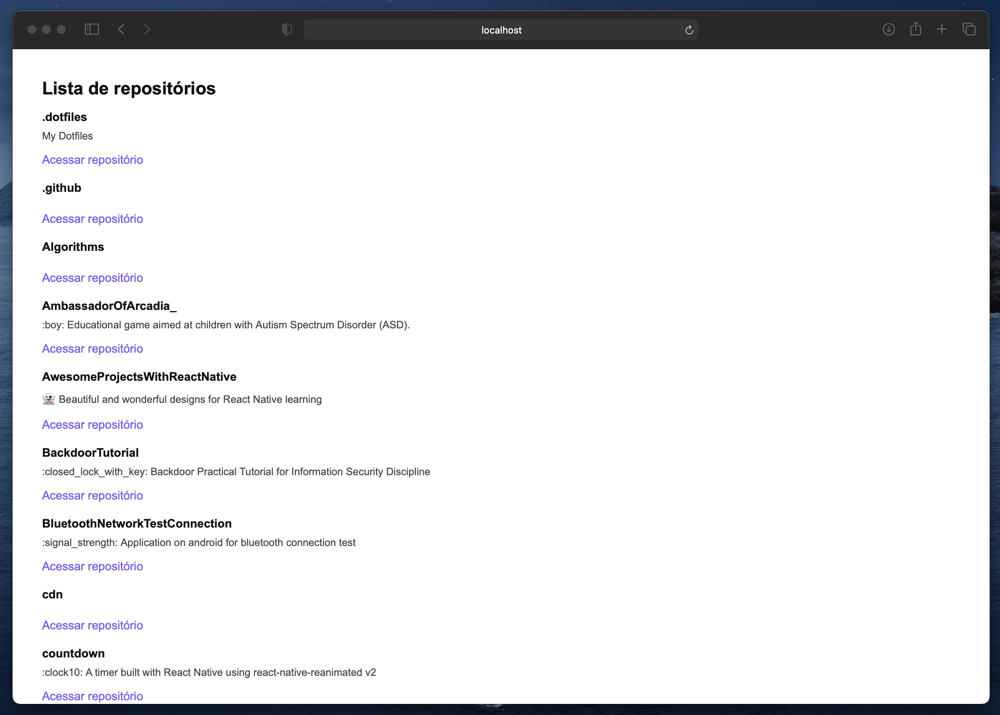

<h1 align="center">
    Github Explorer
</h1>

  

  

  

  

  

<h4 align="center">
  This project is a boilerplate created with the objective of learning a little about the basic structure of a React project.
</h4>

  <a href="#rocket-technologies">Technologies</a>&nbsp;&nbsp;&nbsp;|&nbsp;&nbsp;&nbsp;
  <a href="#memo-license">License</a>

## :rocket: Technologies

This project was developed using the following technologies:

- [ReactJS](https://reactjs.org/)
- [Typescript](https://www.typescriptlang.org)
- [React-router-dom](https://github.com/ReactTraining/react-router)
- [Webpack](https://webpack.js.org/)
- [Babel](https://babeljs.io/)
- [Sass](https://sass-lang.com/)
- [VS Code](https://code.visualstudio.com/)

## :memo: License

This project is under the MIT license. See the [LICENSE](https://github.com/gleydson/github-explorer/blob/master/LICENSE) for more information.

---

Made with ♥ by Gleydson Rodrigues :wave: [Get in touch!](https://www.linkedin.com/in/gleydsonsr/)
